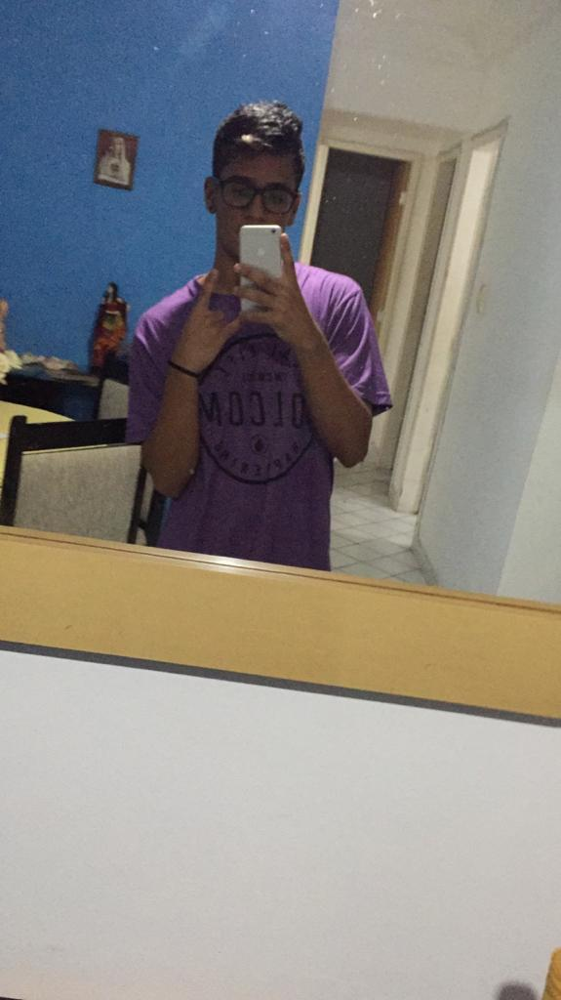

# projeto-css
projeto da disciplina FWD do SENAI, aula sobre CSS

**Objetivos**
Treinar conceitos básicos de HTML e CSS

**Tecnologias**
-HTML
-CSS

**Autores**

Foto | Nome | GitHub | Likedin | E-mail
---- | ---- | ------ | ------- | ------
  | Hudson Duarte | [Hudson Duarte](https://github.com/huduarte) | [Linkedin](https://www.linkedin.com/in/hudson-duarte-345107186/) | hudsoneeto@outlook.com